<!--suppress HtmlDeprecatedAttribute -->

    <picture>
      <source media="(prefers-color-scheme: dark)"
        srcset="assets/stats_dark.svg" /></picture>
    <picture>
      <source media="(prefers-color-scheme: dark)"
        srcset="assets/langs_dark.svg" /></picture>

  
  
  
  

  
  
  
  
  

